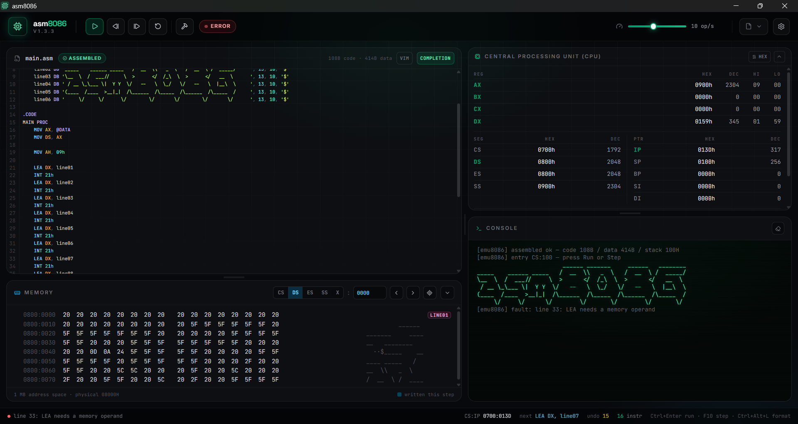

## emu8086 Studio

-------

This project is being developed as an alternative to the __OG *emu8086*__
which have been discontinued long long time ago. The goal of this project
is to provide a modern and user-friendly environment for developing and testing
assembly language programs for the Intel 8086 microprocessor.

> [!WARNING]
> This project is still in early stages of development.
> Some features may not work as expected and some features may be missing.
> Please report any issues you encounter or feature request you have
> [here](https://github.com/arijit4/emu8086-studio/issues/new).

Features supported out-of-the-box:

| Feature                                 | emu8086 Studio | emu8086 |
|-----------------------------------------|----------------|---------|
| Integrated memory and CPU visualization | ✅              | ✅       |
| Complex assembly code simulation        | ✅              | ✅       |
| Variable emulation speed                | ✅              | ✅       |
| Working with local files                | ✅              | ✅       |
| Run without saving to disk              | ✅              | ❌       |
| `STEP FORWORD`, `PAUSE`, `RESUME`       | ✅              | ✅       |
| `STEP BACK`                             | ✅              | ❌       |
| Syntax highlighting                     | ✅              | ⚠️      |
| VIM keybindings                         | ✅              | ❌       |
| Dark theme                              | ✅              | ❌       |
| Built-in examples to learn from         | ✅              | ❌       |
| Code autoformatting `Ctrl + Alt + f`    | ✅              | ❌       |
| Meaningful error messages               | ✅              | ❌       |
| Code auto-completion                    | ✅              | ❌       |
